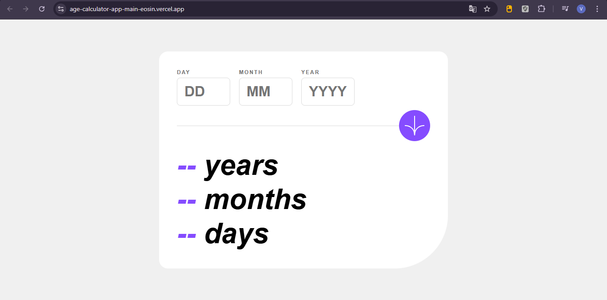
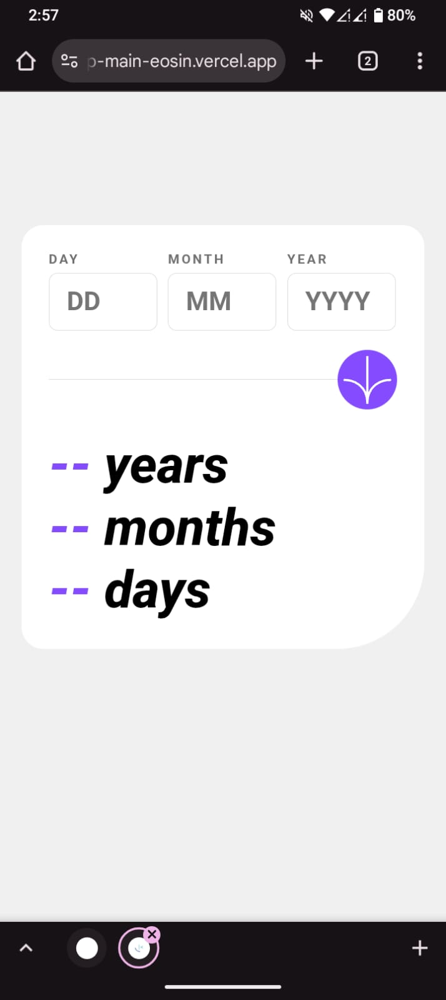

# Frontend Mentor - Age Calculator App

This is my solution to the **Age Calculator App** challenge from Frontend Mentor.
The goal of this challenge is to create an age calculator with strong validation, responsive design, and animated results.

## Table of Contents

* [Overview](#overview)
* [Features](#features)
* [Screenshot](#screenshot)
* [Links](#links)
* [Built With](#built-with)
* [What I Learned](#what-i-learned)
* [Future Improvements](#future-improvements)
* [Useful Resources](#useful-resources)
* [Author](#author)

## Overview

Users are able to:

* Enter their birth date (day/month/year) through a form.
* Get their exact age in **years, months, and days**.
* See validation errors if:

  * Any field is empty
  * The day is not between 1–31
  * The month is not between 1–12
  * The year is in the future
  * The date is invalid (e.g. 31/04/1991)
* View a fully responsive design across mobile and desktop.
* See hover and focus states for all interactive elements.
* **Bonus:** Watch the age numbers animate from 0 to the calculated result.

## Screenshot

Add your screenshot here, for example:

## Links

* **Solution Repository:** [https://github.com/VictorVasquezZT2005/age-calculator-app-main](https://github.com/VictorVasquezZT2005/age-calculator-app-main)
* **Live Demo:** [https://age-calculator-app-main-eosin.vercel.app/](https://age-calculator-app-main-eosin.vercel.app/)

## Built With

* Semantic HTML5
* CSS (variables, grid, flexbox)
* JavaScript (validations, date logic, animations)
* Mobile-first workflow

## What I Learned

* How to implement complete date validation, including month lengths and leap years.
* How to create number animations in JavaScript to enhance the user experience.
* How to build responsive layouts based on a reference mockup.
* How to accurately calculate age using date differences.

## Future Improvements

* Add unit tests for the validation and date logic.
* Add smooth transitions for error messages.
* Implement a dark mode.
* Migrate the project to TypeScript for stronger type safety.

## Useful Resources

* MDN Date Reference: [https://developer.mozilla.org/en-US/docs/Web/JavaScript/Reference/Global_Objects/Date](https://developer.mozilla.org/en-US/docs/Web/JavaScript/Reference/Global_Objects/Date)
* Article on JavaScript date validation: [https://javascript.info/date](https://javascript.info/date)

## Author

* Frontend Mentor: [https://www.frontendmentor.io/profile/VictorVasquezZT2005](https://www.frontendmentor.io/profile/VictorVasquezZT2005)
* GitHub: [https://github.com/VictorVasquezZT2005](https://github.com/VictorVasquezZT2005)